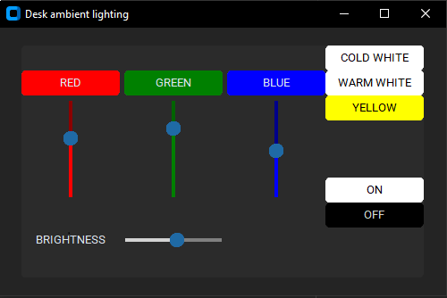

# desk_ambient_lighting
Ambient lighting for my desk

## Table of contents
* [General info](#general-info)
* [Screenshots](#screenshots)
* [Technologies](#technologies)
* [Features](#features)
* [Electrical scheme](#electrical-scheme)

## General info
The lighting of the workplace is very important, and why not create it yourself 
to be able to adjust the color and intensity of lighting to current needs. 

## Screenshots

## Technologies
Project is created with:
* customtkinter version: 5.1.2
* python version: 3.8
* arduino nano every
* addressed led strip WS2813

## Features
The project was prepared as a desctop application, connecting to Arduino via UART (using USB).
It allows you to:
* independent change of the intensity of individual colors (red, green, blue)
* quick color change to red, green, blue, cold white, warm white or yellow using the buttons
* changing the light intensity

## Electrical scheme
